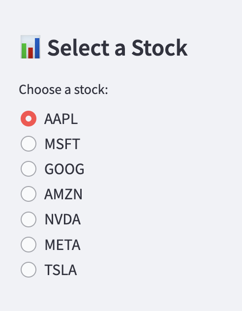
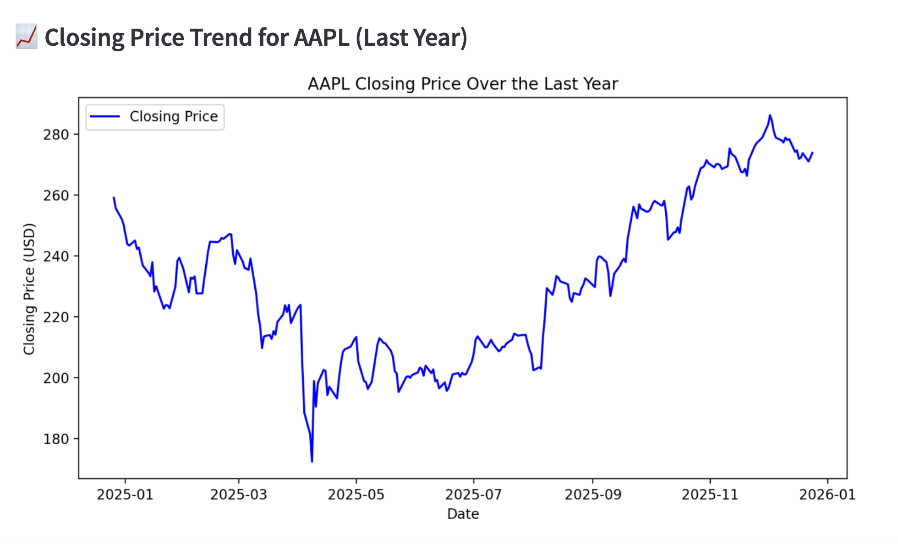
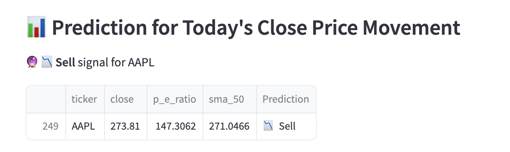

# 📈 Stock_Prediction_ML — AI‑Driven Stock Movement Forecasting

**Author:** Sam Ginzburg  
**Email:** samginzee@gmail.com  
**Tech Stack:** Python · Pandas · XGBoost · Streamlit · SimFin API · Matplotlib

---

## Business Problem & Motivation

Retail investors and analysts are often inundated with market data but lack simple, interpretable tools that combine **financial fundamentals** and **technical indicators** into actionable insights.

The goal of **Stock_Prediction_ML** is to demonstrate how a data analyst can:
- Ingest and clean real‑world financial data
- Engineer meaningful, explainable features
- Apply machine‑learning models appropriately
- Deploy insights through an interactive application

Rather than attempting to "beat the market," this project focuses on **directional forecasting** and **decision support** using a concise, well‑defined feature set.

---

## Project Scope

This project delivers an end‑to‑end stock analysis and prediction application that:

- Pulls live and historical stock data via API
- Merges daily price data with quarterly financial statements
- Engineers valuation and trend‑based features
- Applies a trained XGBoost model to generate **Buy / Sell signals**
- Presents results through a clean, interactive Streamlit interface

The application is intentionally scoped as a **forecasting and analytics prototype**, not an automated trading system.

---

## Methods / Skills Demonstrated

This project showcases the following technical and analytical skills:

- **Python** (data processing, modeling, application logic)
- **Pandas** (data cleaning, joins, time‑series transformations)
- **API Integration** (SimFin financial data)
- **Feature Engineering** (valuation and technical indicators)
- **Machine Learning** (XGBoost classification)
- **Model Serialization & Loading**
- **Streamlit** (interactive analytics dashboard)
- **Data Visualization** (Matplotlib)
- **Environment Variable Management** (.env files)
- **Production‑minded Project Structuring**

---

## Features Used in the Model

After exploratory analysis and feature testing, the final model uses a concise and interpretable feature set:

| Feature | Description |
|------|-------------|
| **Closing Price** | Captures short‑term market behavior |
| **P/E Ratio** | Fundamental valuation signal |
| **50‑Day SMA** | Medium‑term trend indicator |

The target variable is **next‑day price movement direction (up/down)**.

---

## Results

The application successfully:

- Displays merged historical financial and price data
- Visualizes one‑year closing price trends
- Generates real‑time **Buy / Sell signals** for selected stocks
- Handles non‑trading days and missing data gracefully

Predictions are presented as **directional signals**, prioritizing interpretability over unrealistic accuracy claims.

---

## Quick Glance at the Application

Below is a snapshot of the Streamlit application, highlighting the core analytical functionality and user experience.

### Stock Selection Interface
Users can select from major U.S. large‑cap equities (the “Magnificent Seven”) using a simple sidebar control.



---

### Historical Price Trend Visualization
The application visualizes the selected stock’s closing price over the past year, enabling quick trend inspection and context before viewing model output.



---

### Machine Learning Prediction Output
Based on the most recent available trading day, the trained XGBoost model generates a directional **Buy / Sell** signal using engineered financial and technical features.



---

## Project Structure

```
Stock_Prediction_ML/
│
├── app_new_structure.py    # Main Streamlit application
├── pages/
│   └── go_live.py          # Live prediction interface
├── notebooks/
│   ├── training.ipynb      # Model training & experimentation
│   └── kpi2.ipynb          # Feature analysis
├── data/
│   └── mag7_data.zip       # Processed datasets
├── assets/
│   └── mag7_data.zip  
├── mag7_final_model.json   # Trained XGBoost model
├── simfin_api.py           # Custom API wrapper
├── requirements.txt
├── .gitignore
└── README.md
```

---

## How to Run This Project

1. Clone the repository
2. Install dependencies:
   ```bash
   pip install -r requirements.txt
   ```
3. Create an environment file:
   ```bash
   cp keys.env.example -> keys.env
   ```
4. Inside the 'keys.env' file, please insert the following information:
   ```bash
   SIMFIN_API_KEY="{insert your API key here}"
   ```
5. Launch the application:
   ```bash
   streamlit run app_new_structure.py
   ```

The `keys.env` file is excluded from version control.

---

## Limitations

- Predictions are short‑term and directional only
- External macroeconomic events are not modeled
- This project is designed for learning and demonstration purposes

---

## Disclaimer

This project is for **educational and analytical purposes only** and does **not** constitute financial or investment advice.


